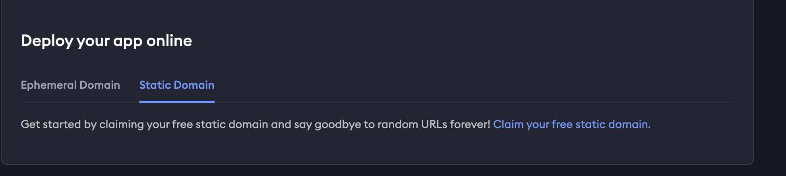
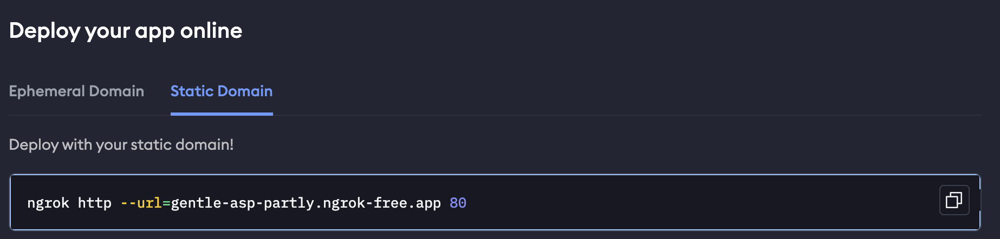
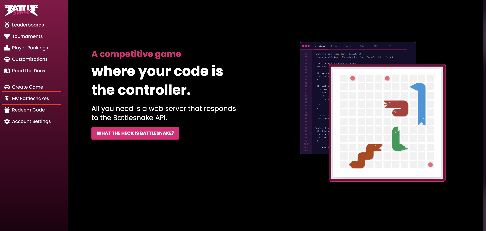
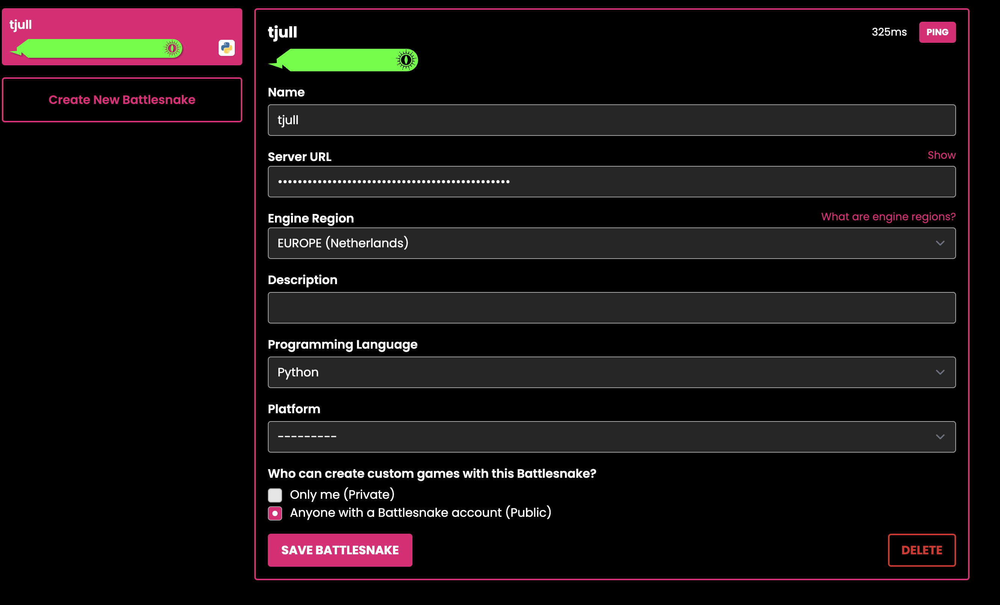

# 🚀 Exposing a Local Server with ngrok 
To be able to use your Snake on the [BattleSnake](https://play.battlesnake.com/) website you must setup a server that hosts the functions responsible for your snake. An easy way of doing so is by setting up a ngrok server that listens to a localhost port.
Follow these steps to use [ngrok](https://ngrok.com) to expose a local server to the internet.

## 🔧 Prerequisites

- Python, Node.js, or any other server running locally (e.g., `localhost:5000`)
- ngrok installed (instructions below)

## 📦 Step 1: Create ngrok account and follow instructions for installation
Go to [https://dashboard.ngrok.com/signup](https://dashboard.ngrok.com/signup), and setup your account.

## 📦 Step 2: Click the static domain and claim free static domain

## 📦 Step 3: Paste the command in to your terminal. The last digits are which ports the ngrok server listens to. We have it to default at 8080 so, change it 8080

This will be the output:

Copy the url in the Forwarding. This is the domain name

## Do not close the terminal window running this command. It has to be active for the server to be running

## 📦 Step 4: Create BattleSnake account
Head over to [https://play.battlesnake.com/](https://play.battlesnake.com/) and create your account

## 📦 Step 4: Create a Snake and link to server url

Under My battlsnake, click on create BattleSnake. 

Fill in with prefered name etc. Under Server URL, make sure to print the previously made ngrok domain name. 

## Now your snake is ready for deployement

Go back to [README](../README.md) for next set of instructions
